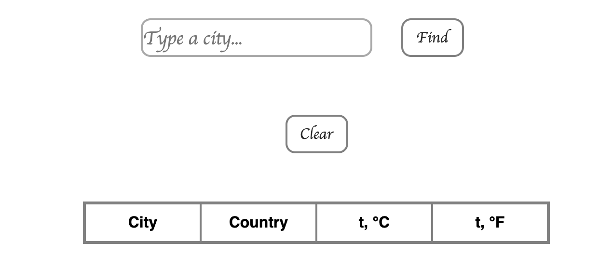

## Async development

* [Presentation](https://sulemanof.github.io/js-lectures/async-development/presentation/#/)
* Weather app
  * Go to [Weather stack](https://weatherstack.com/) and create account
  * Clone [this](https://github.com/tr3v3r/weather-app) repository
  * Using [Weather stack api](https://weatherstack.com/documentation) fetch weather for the data from input
  * Render weather for each city in the table
  * If weather for city has already fetched - replace it
  * On **Clear** button press - clear table
  * If table has no raws - hide it




## Hometask
* Clone your **TMS-your-name** repository
* Create folder with name **weather-app** in master branch
* Copy files from repository from *class work* to **weather-app** folder
* push your changes into master
* Create and switch to branch with name **weather-app**
* Open **weather-app** folder in your VSCode / WebStorm
* Go to [locationiq](https://locationiq.com/) and create account
* Take **lat, lan** data from weather api response and using **locationiq** [api](https://locationiq.com/docs#forward-geocoding) put map under the table with marker on the folowing location.

## Exampe 
* After fetching weather data for *New York* you'll get response like:
```
{
    "request": {
        "type": "City",
        "query": "New York, United States of America",
        "language": "en",
        "unit": "m"
    },
    "location": {
        "name": "New York",
        "country": "United States of America",
        "region": "New York",
        "lat": "40.714",
        "lon": "-74.006",
...
```
* Take **lat**(latitude) and **lan**(longitude) and render map with marker on this point
