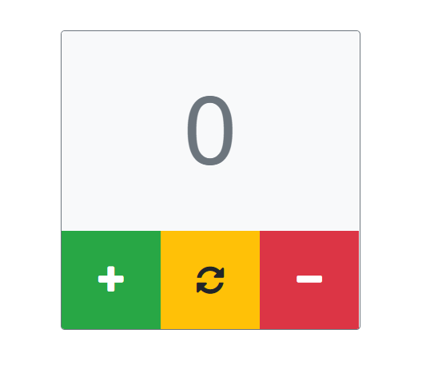

## NPM. Modules

* [Presentation](https://slides.com/danielsuleiman/npm#/)	
* Install [browserify](http://browserify.org/)	
* Install [babelify](https://github.com/babel/babelify)
* Implement Counter based on modules	
  * Create folder **modules** and **idnex.js** inside	
  * Create module **Counter.js** (class with state, and methods for increment / decrement)
  * Create module **createElement.js**. Function wich should work like:
```	  * Create **src** folder
 const decrementButton = createElement(	 
   'div',	
   { style: "button center decrement", onClick: () => { // your code on click } },	
   [	
     "-"	
   ]	


 <div style="button center decrement">"-"</div>	
```	

* Re export this modules to make possible use them like `import { Counter, createElement } from './modules'`	
* Create **index.js** near **modules** folder and using *Counter* and *createElement* create 3 buttons and counter element	
* Everything should work without any html tags inside.	


* styles you can find [here](https://github.com/tr3v3r/simple-counter/blob/master/styles.css) 
  
## Hometaks
Rewrite your **weather-app** using modules.

Your app should consist of at least several modules. i.e.
* Module for fetching data
* Module for rendering and manging map
* Module for rendering and mangin table
* Module for handling localstorage
* Module createElement 


