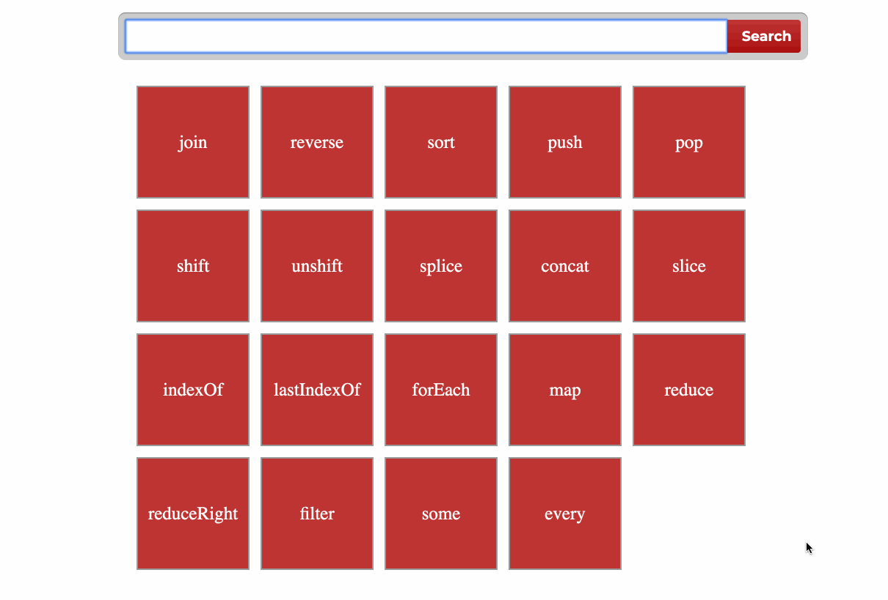

## Webpack

* [Presentation](https://slides.com/danielsuleiman/webpack/#/)
* clone [this](https://github.com/tr3v3r/webpack-search)
* **npm init**
* **npm i --save-dev webpack**
* **npm i --save-dev webpack-cli**
* **npm i --save-dev style-loader**
* **npm i --save-dev css-loader**
* create **webpack.config.js** and set up config (*style-loader*, *css-loader* with modules support, *html-webpack-plugin*)
* Implement Search/Add. 
  * Create **src** folder
  * Try to split your logic into modules ( i.e. Form, Box, Store ) 

